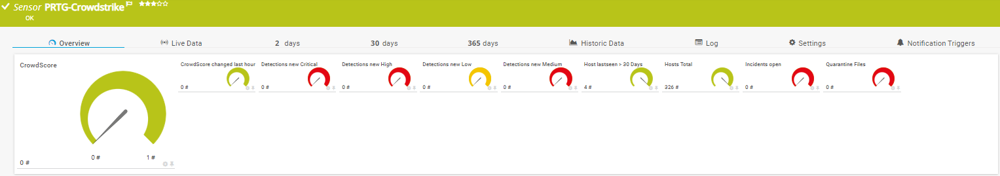
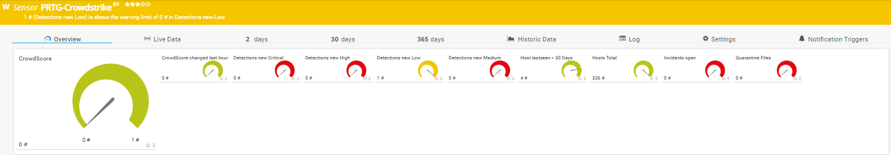

# PRTG-CrowdStrike.PS1

<!-- ABOUT THE PROJECT -->
### About The Project
Project Owner: Jannos-443

PRTG Powershell Script to monitor CrowdStrike

Free and open source: [MIT License](https://github.com/Jannos-443/PRTG-CrowdStrike/blob/main/LICENSE)


<!-- GETTING STARTED -->
## Getting Started
1. Log into CrowdStrike
   
   - add new API/Token

   - You need "devices:read, incidents:read, detects:read and quarantine:read" permission
   

2. Make sure the FalconPS Powershell Module exists on the Probe
   - https://github.com/CrowdStrike/psfalcon/wiki


3. Create new Sensor

   | Settings | Value |
   | --- | --- |
   | EXE/Script Advanced | PRTG-CrowdStrike.ps1 |
   | Parameters | -ClientId "YourCrowdStrikeAPIClientID" -ClientSecret "YourCrowdStrikeAPIClientSecret"|
   | Scanning Interval | 30 minutes |

Default API Hostname is "https://api.eu-1.crowdstrike.com" use -Hostname to change it to your Cloud

## Usage

```powershell
PRTG-CrowdStrike.ps1 -ClientId "YourCrowdStrikeAPIClientID" -ClientSecret "YourCrowdStrikeAPIClientSecret" -Hostname "https://api.eu-1.crowdstrike.com"
```





